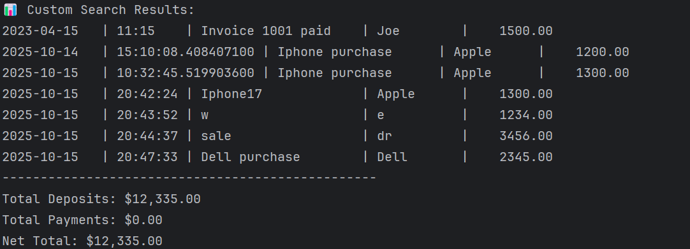

# 📒 Accounting-Ledger-Application

---

## ✨ Quick Overview

This is a **Java-based Ledger Application** that allows users to track financial transactions.  
It supports **deposits, payments, reports**, and **custom searches**, while storing all data in a CSV file for persistence.

**Users can:**

- View all transactions (newest first)
- Generate **month, year, and previous period reports**
- Search by vendor or perform a **custom search**
- Enjoy **validated input** and a clean **menu-driven interface**

---

## 💻 Features

| Feature | Description |
|---------|-------------|
| 💰 Add Deposit | Record money coming into the account |
| 🏦 Make Payment | Record payments (negative amounts) |
| 📊 Display All | Shows all transactions in a table format |
| 🗂️ Reports | Month-to-date, previous month, year-to-date, previous year |
| 🔍 Search by Vendor | Search transactions by vendor name (case-insensitive) |
| 🛠️ Custom Search | Filter transactions by date range, vendor, description, or amount |
| 📝 Persistent Storage | Transactions saved in `Transaction.csv` automatically |

---

## 🌟 Code Snippet I’m Proud Of

This **custom search** method is robust, allowing optional filters on multiple transaction attributes:

```java
public void customSearch(List<Transaction> transactions, LocalDate startDate, LocalDate endDate,
                         String vendor, String description, Double minAmount, Double maxAmount) {
    System.out.println("📊 Custom Search Results:");
    double totalDeposits = 0;
    double totalPayments = 0;

    for (Transaction t : transactions) {
        boolean matches = true;
        if (startDate != null && t.getDate().isBefore(startDate)) matches = false;
        if (endDate != null && t.getDate().isAfter(endDate)) matches = false;
        if (vendor != null && !t.getVendor().equalsIgnoreCase(vendor)) matches = false;
        if (description != null && !t.getDescription().toLowerCase().contains(description.toLowerCase())) matches = false;
        if (minAmount != null && t.getAmount() < minAmount) matches = false;
        if (maxAmount != null && t.getAmount() > maxAmount) matches = false;

        if (matches) {
            System.out.println(t);
            if (t.getAmount() > 0) totalDeposits += t.getAmount();
            else totalPayments += t.getAmount();
        }
    }

    System.out.println("-------------------------------------------------");
    System.out.println("💵 Total Deposits: $" + totalDeposits);
    System.out.println("💸 Total Payments: $" + totalPayments);
    System.out.println("📈 Net Total: $" + (totalDeposits + totalPayments));
    System.out.println("-------------------------------------------------");
}
```





